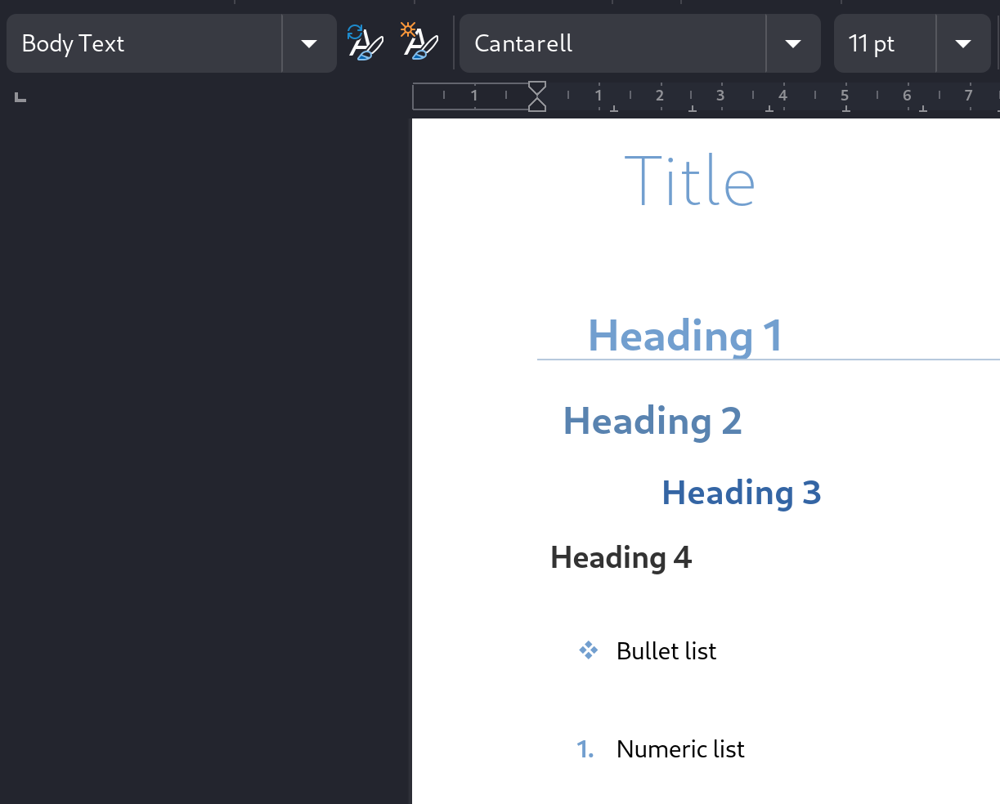
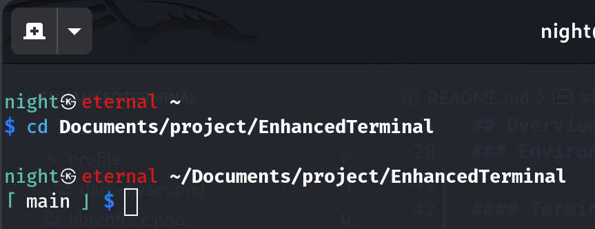
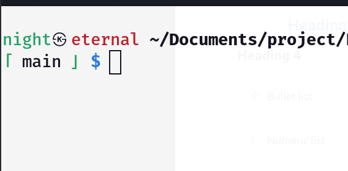
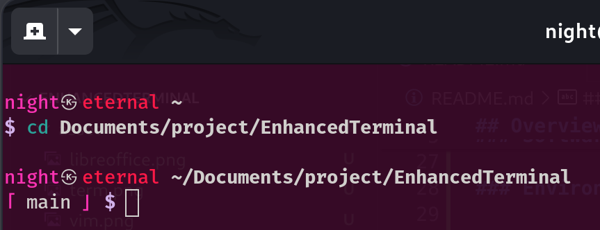
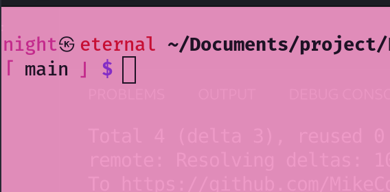
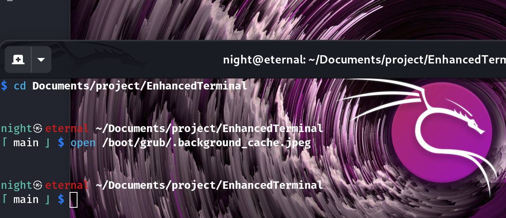
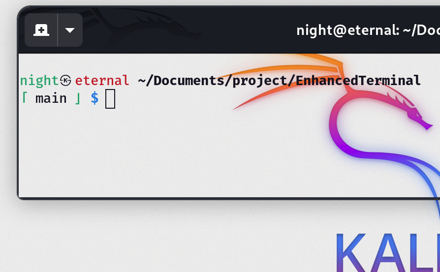
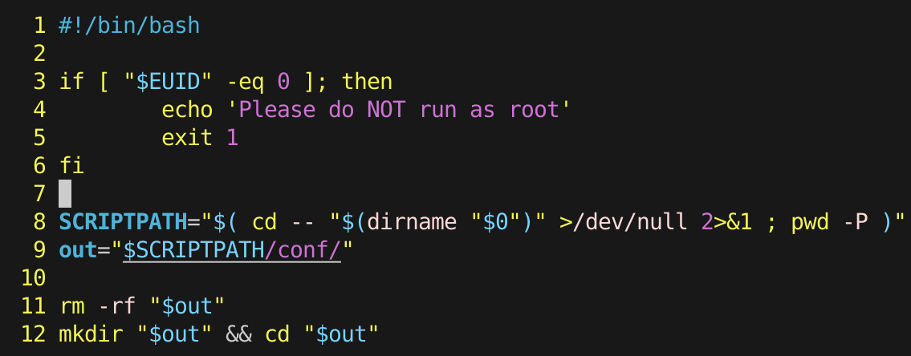

## Overview

This project aims to setup my actual environment as I needed to setup many times.

[My personal environment](#environment-update)
- [LibreOffice Template](#libreoffice-template)
- [Terminal Profiles](#terminal-profiles)
- [ZSH aliases](#zsh-aliases)
- [VSCode Keyboard Shortcuts](#vscode-keyboard-shortcuts)
- [Additional Fonts](#additional-fonts)
- [Gnome Settings](#gnome-settings)

## Install

```sh
chmod +x import.sh
sudo ./import.sh
```

## Software installed

- Development
  - VS Code
  - NVM, Node.js & npm

- Work software
  - GIMP
  - LibreOffice (with gnome extension)

- Convenience Software
  - VLC
  - Spotify
  - WhatsDesk (unofficial WhatsApp UI)
  - Telegram
  - Discord
  - Bluetooth & Blueman

- Utils
  - qBittorrent
  - PDF tools
  - Snap package manager
  - Hex editor
  - Vim

## Environment update

### LibreOffice Template



| Element | Size (pt) | Color | Left padding (cm) | Other style |
|---|---|---|---|---|
| **Title** | 32 | Light Blue 2 | 1.4 | Font: Cantarell Light |
| **Heading 1** | 20 | Light Blue 2 | 0.8 (Border) | Border: Bottom 0.05pt, Light Blue 3 |
| **Heading 2** | 18 | Light Blue 1 | 0.4 |  |
| **Heading 3** | 16 | Dark Blue 1 | 2.0 |  |
| **Heading 4** | 14 | Dark Gray 2 | 0.2 |  |

### Terminal Profiles

| Dark Profile | Rendering | Light Profile | Rendering |
|---|---|---|---|
| **Dark** |  | **Light** |  |
| **Dark Sweet** |  | **Light Sweet** |  |
| **Dark Transparent** |  | **Light Transparent** |  |

### ZSH aliases

#### Node
| Command | Alias | Description |
|---|---|---|
| `npu` or `npmu` | `npm uninstall` |
| `ntree` | `tree -I "font\|img\|node_modules" .` | List project files |
| `start` | `npm start` |

#### Git
| Command | Alias | Description |
|---|---|---|
| `ga` | `git add` |
| `gco` | `git commit -m` |
| `gch` | `git checkout` |
| `gcl` | `git clone` |
| `gd` or `gdiff` | `git diff` |
| `gl` or `glog` | `git log` |
| `gstat` | `git status` |
| `gsw` | `git switch` |
| `pull` | `git pull` |
| `push` | `git add .`, `git status`, `git commit -m "<input>"`, `git push` | All in one |

#### Miscellaneous

| Command | Alias | Description |
|---|---|---|
| `cah` | `highlight` | Print file content highlighted according to format |
| `help [<text>]` | | Display a help. If an argument is given call `search <text>` |
| `help-recovery` | | Display a help intended for recovery |
| `la` | `ls -lA` |
| `lb` | `ls /bin \| column` | List programs within `/bin` |
| `lc` | `echo $?` | Last code |
| `ll` | `ls -l` |
| `search <text>`  | `man -k "$@" \| grep "(1)" \| cut "-d " -f1,3-` | Search a text within manual. Looking on the first page |

### VSCode Keyboard Shortcuts

| Key | Command |
|---|---|
| `²` | Toggle Line Comment |
| `ctrl` + `²` | Toggle Line Comment |
| `ctrl` + `K` | Open Keyboard Shortcuts |
| `ctrl` + `W` | Rename File |

### Additional Fonts

* Inter
* Lato
* Open Sans
* Poppins
* Roboto
* Ubuntu

### Vim Settings


Line numbering on

### Gnome Keyboard Shortcuts

| Key | Command |
|---|---|
| `F1` | Volume mute |
| `F2` | Volume down |
| `F3` | Volume up |
| `F9` | Full screen capture |
| `shift` + `F9` | Screen capture |
| `ctrl` + `F9` | Window Screen capture |
| `shift` + `ctrl` + `F9` | Screen recorder |
